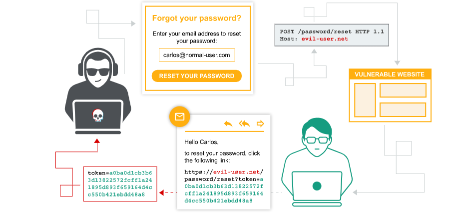
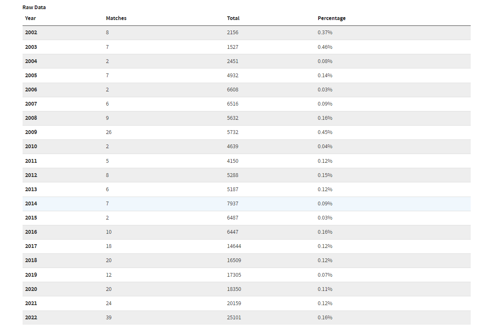
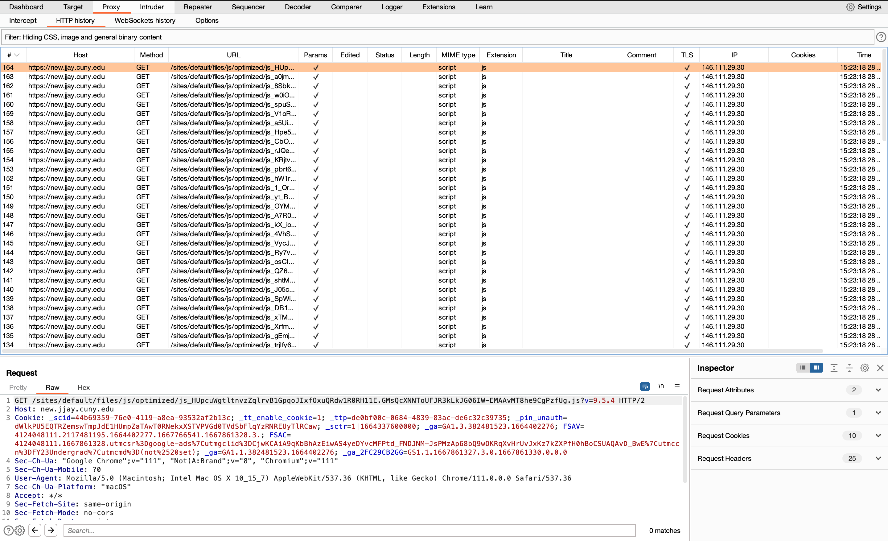

# HTTP-Host-Header-Attack
This project was for the Computer Security and Forensics, Spring 2023 semester at John Jay College of Criminal Justice.

                                                              HTTP Vulnerability Analysis
                                                              
                                                               "HTTP Host Header Attack"
                                                               
                                                                          By
                                                                          
                                                                  Md Jayadul Islam
                                                                  
                                                              md.islam1@jjay.cuny.edu
                                                              
                                                                          For
                                                                          
                                                  CSCI-411 Computer Security and Forensics, Spring 2023
                                                  
                                                              Instructor: Professor Aftab Ahmad
                                                              
                           
                           
           The work reported in this document, including creating this report, was done by me, except were cited with the accompanying source 
           reference and permission if required by the source. No part of the report was produced by a non-human, software, or hardware. 
           Any exception to this statement can be considered a breach of academic integrity.
                                                                      
                                                                      Submitted on
                                                                      
                                                                     April 02, 2023
                                                                     
                                                      Department of Mathematics and Computer Science
                                                      
                                                            John Jay College of Criminal Justice
                                                            
                                                          524 West 59th Street, New York, NY 10019
                                                          
                                                          
                                                          

(K)nowledge:

Starting with the knowledge part of the report, I will learn the zero-day vulnerability of the HTTP protocol. However, before beginning writing, we need to know how the HTTP protocol works.

HTTP stands for Hypertext Transfer Protocol. It is an application protocol for transferring data over the web, most commonly used for accessing websites on the internet. HTTP sends requests from a client (such as a web browser) to a server, which then responds with data. The requests and responses are sent in a specific format that follows a set of rules and conventions outlined in the HTTP specification. For example, when a user enters a URL into their web browser, the browser sends an HTTP request to the server hosting that website. The server then responds with the website's HTML, CSS, JavaScript, and other files, which the browser interprets and displays to the user. But since this protocol was created, many vulnerabilities, exploits, and attacks have existed. As a consequence, users' accounts and personal information were breached.

HTTP vulnerabilities can occur due to flaws in the protocol's design, implementation, or configuration, which attackers can exploit to launch attacks. In the context of HTTP vulnerabilities, exploits are typically used to take advantage of weaknesses in the protocol implementation to achieve a specific goal. For example, an attacker could use an HTTP exploit to host header attack and gain unauthorized access to a web application or server. There are different HTTP exploits, including buffer overflows, authentication bypassing, cross-site scripting (XSS) attacks, DoS etc. Attacks using HTTP exploits can have a wide range of consequences, depending on the severity of the vulnerability and the attacker's goal. For example, some HTTP exploits attacks can result in data theft, Denial of service (DoS) attacks, or even complete web server control.

To illustrate two HTTP attacks, we can look into the most common vulnerabilities: HTTP header and DDoS attacks.
HTTP Host header attack: When a user requests to change the website password for login, the website makes a unique token and sends a password-changing link along with the token via email or message. When the user visits the link, the website checks whether the token is valid. If the token is valid, the user can change the website password. But in this attack, an attacker targets a vulnerable website and user due to HTTP protocol vulnerability. Then, he sends a request on the login page by putting the targeted user's email address for a password reset. Once the HTTP request has been intercepted, the attacker alters the HTTP host header to point to a domain that is under his control. For example,

"POST /password/reset HTTP 1.1
Host: evil-user.net" (portswigger.net)

The website makes a unique token and sends a password-changing link to the user's email address. On the user side, the user gets a genuine email address from the vulnerable website and clicks the link it provides. But as soon as the user clicks on the password-changing link, the attacker receives the genuine token the website sends the user by email in the attacker server. Now the attacker can change the token in the password-changing link, and he can change the user's password.

                                          Diagram 1.1 - HTTP host header attack from www.portswigger.net 

DDoS attack: Another attack carried on by an HTTP protocol vulnerability is a distributed denial of service attack (DDoS). When a user wants to visit a website, he must complete TCP three-way handshake. Next, the client sends an SYN packet to the server, indicating its desire to initiate a connection. The server then responds with an SYN-ACK packet, indicating its willingness to establish a connection. The final step involves the client sending an ACK packet, confirming that it has received the server's response and that the connection has been established. But in this attack, the attacker does not establish the TCP connection but sends only the SYN packet to the server. The SYN packet is tiny in size. To make it bigger, the attacker uses a packet amplifier before sending the packet to the server. We call this a Denial of service or (DoS) attack. Also, to make it more effective, the attacker uses a lot of zombie computers called a botnet. When many botnets send SYN requests to the server simultaneously, we call this Distributed denial of service or (DDoS) attack. A DDoS attack aims to disrupt the normal functioning of the target system or website by overwhelming its resources. This can result in legitimate users who cannot access the system or website.

                                          Diagram1.2 – DDoS attack from www.akamai.com
                                         
                                         

(S)kills:

In this skill part, I will demonstrate the tool I will use to attack the HTTP protocol's vulnerability, such as HTTP host header attack.

HTTP host header attack has been the most common and manipulating attack since it was discovered. However, by pulling the data from the National vulnerability database(NVD), I found it overwhelming, still compromising, and never outdated. For example, in the table from NVD, we can see that among the 25101 vulnerabilities, and there are 39 vulnerabilities still exist.

                                        Table 1.1- HTTP host header attack statistics from NVD
 
First, we must find a tool for a web application vulnerability scanner and data traffic intercepting tool. Then we will take one tool among them to demonstrate the vulnerability and the attack. Many tools, including OWASP, Burp suit, Openvs, etc, are used to find vulnerabilities and penetration test a website application. In this project, we will compare OWASP and burp suite tools below.

The Open Web Application Security Project (OWASP) offers a range of tools that can be used for vulnerability assessment, penetration testing, and secure coding. One of the most popular tools is OWASP ZAP (Zed Attack Proxy), an open-source web application security scanner used to identify vulnerabilities in web applications. On the other hand, Burp Suite is a web vulnerability scanner and testing tool used to identify security vulnerabilities in web applications. It is designed to be used by security professionals and developers to test the security of web applications before they are deployed. However, OWASP is an automated tool with the top 10 most critical web application security risks. That means when any penetration tester starts the scan, the scan runs automatically until the web application breaks down.

On the other hand, the burp suit has more user-specified and advanced options that any penetration tester can work on as he wants. So, I choose the burp suit over OWASP because I want to intercept the traffic going from my computer to the server, and I also want to edit the HTTP header and manually send the request to the server. So, in this case, burp suit has much more to offer than OWASP.

In the installation process, I will install the burp suit community edition on my MacOS(M1) pro laptop. As of March 23, 2023, version 2023.2.4, The size of the application is 231.1 Mb for MacOS(M1) computer. It took almost 4 minutes to download the application. After downloading the application, I installed it on my laptop. After the installation, the browser needs a few steps to configure with the burp server to capture the data flow from my computer to the destination server.

Basically, the burp suit works in the middle between the host and the website or server. When a host requests something from the website or the server, the data goes to the burp server first and then to the website or server. So, I need to configure my browser to work with burp suit to establish this process. In this case, I will use google chrome. I added a manual proxy in the chrome browser settings and saved the setting as follows.

                               
                               Screenshot 1.1 Chrome browser settings
 
There is another way to add the proxy server to the browser is that Burp suit proxy has an extension for google chrome named FoxyProxy Standard. We can add this extension to the browser and toggle it on and off before and after using the application. By adding this extension to the browser, we don’t need to add the browser manual proxy settings again.

For a security layer, we need to install a Burp certificate in our machine because "One of the key functions of TLS is to authenticate the identity of web servers that your browser communicates with. This authentication process helps to prevent a fraudulent website from masquerading as a legitimate one, for example. It also encrypts the transmitted data and implements integrity checks to protect against man-in-the-middle attacks. In order to intercept the traffic between your browser and the destination web server, Burp needs to break this TLS connection. As a result, if you try and access an HTTPS URL while Burp is running, your browser will detect that it is not communicating directly with the authentic web server and will show a security warning. To prevent this issue, Burp generates its own TLS certificate for each host, signed by its own Certificate Authority (CA). This CA certificate is generated the first time you launch Burp and stored locally. To use Burp Proxy most effectively with HTTPS websites, you need to install this certificate as a trusted root in your browser's trust store. Burp will then use this CA certificate to create and sign a TLS certificate for each host that you visit, allowing you to browse HTTPS URLs as normal." -(portswigger.net/burp/documentation).

After installing the burp suit, we are ready to test the HTTP host header vulnerability and draw the attack. Here is the screenshot after the installation of the Burp suit; here, you can see that the burp suit started capturing the data traffic.

](https://github.com/mdjislam123/HTTP-Host-Header-Attack/blob/main/Screenshot%201.2.png)
                                     
                                     Screenshot 1.2 from my laptop
                                     
 
(A)bilities:

In this part, I will demonstrate the actual HTTP host header attack in a lab environment to experiment by capturing and deploying the attack.

Step 1:

Here you can see that, on this website, we have our lab environment ready, and by clicking the button “Access the lab,” we will start the lab. However, before beginning, we also need the burp suit application open and, in the browser, we need to set the burp proxy on.

                                   Screenshot 1.3 lab environment

Now, we can see that our default username for the website is "wiener," and our password is "peter." So, in our lab, we will intercept the "wiener's" HTTP request and steal Carlos's account.

Step 2:

After accessing the lab, we can see that we automatically logged in to the "wiener's" account. Now I will
click the to the account button; we can see that we have the account login page.

                               Screenshot 1.4 “wiener’s” website account

                              Screenshot 1.5 login page      

Now, I will click on the forgot password button, put the username "wiener," and press the submit button to send the HTTP request for "wiener's" password change. Now we can also access "wiener's."

                             Screenshot 1.6 password reset page

email server by clicking the "Go to exploit server" button. In screenshot 1.7, we can see that we made a request for a password reset for "wiener's" account. In this screenshot, we also can see that the website has sent a link to change the password along with a unique token inside the link. When the user clicks on the link, it will redirect to the website, and the website will check whether the token is valid or not to change the password.

                            Screenshot 1.7 “wiener’s email server

Step 3:
Looking at the burp suite, we already captured the HTTP request for password reset of the user.

                            Screenshot 1.8 burp suit capturing HTTP request.

Now we will further investigate the HTTP request with "wiener's" password reset link in the email server.

                           Screenshot 1.9 password reset page.
                           
When we compare screenshot 1.9 and screenshot 1.7, we can see that in the HTTP header host address remains the same.

Step 4:

Now, I will send the password reset request again, but this time I will modify the HTTP host header pointing to my exploit server address, and we will change the username "wiener" to "carlos" since I am hacking into "carlos" account. In screenshot 2.0, you can see that the lab environment has my exploit server and address.

                         Screenshot 2.0 exploit server address.

                         Screenshot 2.1 Host header pointing to my exploit server and username “wiener” to “carlos”.

Now in the "Carlos’s" email server, he will receive a password reset email with a malicious HTTP host header. So that means when "Carlos" clicks the password reset link, I will get his password reset token in my exploit server.

Note: In this case, the hacker will use social engineering techniques to make the user click on the link. If the user does not click on the link, the hacker does not receive the password reset token on his server. Now, I assume that the user "Carlos" clicked on the link.

Here you can see that after “Carlos," click on the password reset link, and my server has received a token that the website has sent to the "Carlos" email address for password reset.

                        Screenshot 2.2 exploit server with password reset token.

I will now copy the token from my exploit server, replace the token with "wiener's" password reset token form his email server, and send the HTTP request to the browser URL.

                        Screenshot 2.3 password reset option in carlos’s account.

Here you can see that, the I password reset option of the "carlos" account. So now I have changed the password and logged into his account with his username and new password.

                        Screenshot 2.4 carlos’s account

Here you can see that I have logged in to the "carlos" account, and we have completed our HTTP host header attack.

Conclusion:

In conclusion, the HTTP Host Header Attack is a critical flaw that attackers can use to get past web application firewalls and execute a variety of attacks like phishing, cookie stealing, and more. Web designers and administrators should always check that the Host header value matches the expected value on the server to prevent this kind of attack.

Using a web application firewall that can examine and deny requests with erroneous or unexpected Host headers is one technique to mitigate this problem. Additionally, employing HTTPS can protect against man-in-the-middle attacks and guarantee that client and server communications are safe.

                                        References and Citations
1. HTTP host header - https://portswigger.net/web-security/host-header
2. DDoS - https://www.akamai.com/our-thinking/ddos?gclid=CjwKCAjwoIqhBhAGEiwArXT7KxEc0l9WWBWx5WAafdQ_H1iP0wiX0IXZicu41F6qombcBrwBiyw3NxoCZUcQAvD_BwE&utm_source=google&utm_medium=cpc&utm_campaign=F-MC-52611&utm_term=what%20is%20ddos&utm_content=US&ef_id=CjwKCAjwoIqhBhAGEiwArXT7KxEc0l9WWBWx5WAafdQ_H1iP0wiX0IXZicu41F6qombcBrwBiyw3NxoCZUcQAvD_BwE:G:s&s_kwcid=AL!5241!3!587599141837!p!!g!!what%27s%20ddos!16563847831!140191911491
3. Diagram 1.1 - https://portswigger.net/web-security/host-header/exploiting/password-reset-poisoning
4. Diagram 1.2 - https://www.akamai.com/our-thinking/ddos?gclid=CjwKCAjwoIqhBhAGEiwArXT7KxEc0l9WWBWx5WAafdQ_H1iP0wiX0IXZicu41F6qombcBrwBiyw3NxoCZUcQAvD_BwE&utm_source=google&utm_medium=cpc&utm_campaign=F-MC-52611&utm_term=what%20is%20ddos&utm_content=US&ef_id=CjwKCAjwoIqhBhAGEiwArXT7KxEc0l9WWBWx5WAafdQ_H1iP0wiX0IXZicu41F6qombcBrwBiyw3NxoCZUcQAvD_BwE:G:s&s_kwcid=AL!5241!3!587599141837!p!!g!!what%27s%20ddos!16563847831!140191911491
5. Table 1.1 - https://nvd.nist.gov/vuln
6. Lab environment - https://portswigger.net/web-security/host-header/exploiting/password-reset-poisoning
7. burp certificate documentation - https://portswigger.net/burp/documentation/desktop/external-browser-config/certificate

